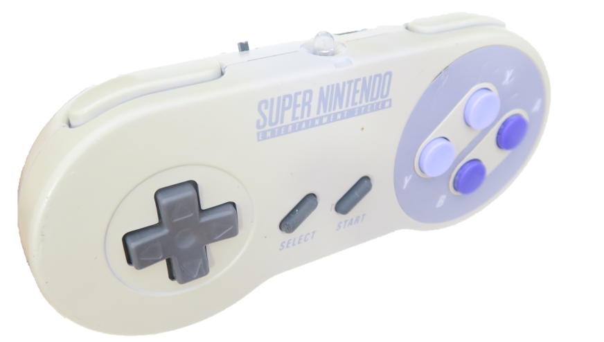
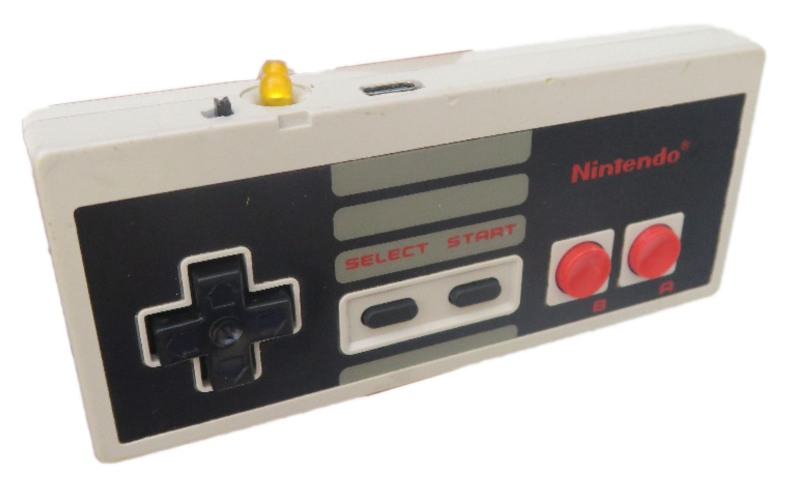

[PAGINA PRINCIPAL](index.md)

# CONTROLES SWITCH DIY

En este proyecto aprenderemos a convertir nuestros controles en controles compatibbes con nuestro nintendo switch.
Este proyecto esta basado en el trabajo de [mitchellcairns](https://github.com/mitchellcairns)

Y quiero agradecer a Ervin Olvera por ayudarme a terminar este proyecto.

### Nuestro primer control sera el de SNES

###### FIRMWARE DONDE DEBES AGREGAR BOTONES EXTRAS

<esp-web-install-button manifest="proyectos/controles_switch/snes/manifest.json"></esp-web-install-button>

### ----------------------------

###### FIRMWARE DONDE NO DEBES AGREGAR BOTONES EXTRAS
###### SELECT+L=ZL y SELECT+R=ZR

<esp-web-install-button manifest="proyectos/controles_switch/snes_no_botones/manifest.json"></esp-web-install-button>

### Nuestro segundo control sera el de N64

<esp-web-install-button manifest="proyectos/controles_switch/n64/manifest.json"></esp-web-install-button>

### Nuestro tercer control sera el de NES

###### Con este firmware tu control sera detectado como control de NES

<esp-web-install-button manifest="proyectos/controles_switch/nes/manifest.json"></esp-web-install-button>

###### Con este firmware tu control sera detectado como control de FAMICON

<esp-web-install-button manifest="proyectos/controles_switch/fc/manifest.json"></esp-web-install-button>
