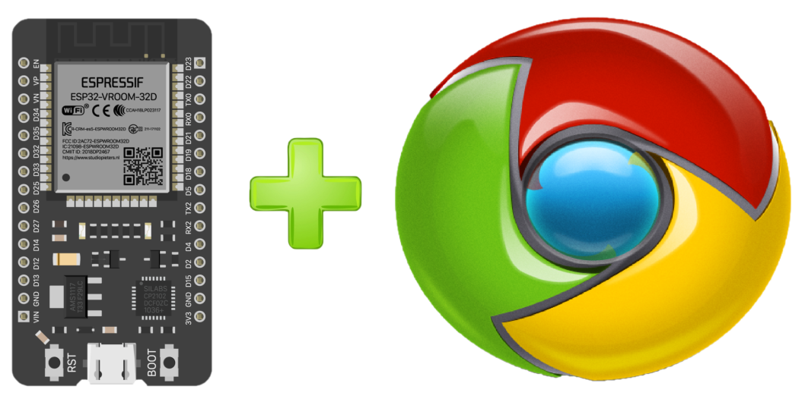
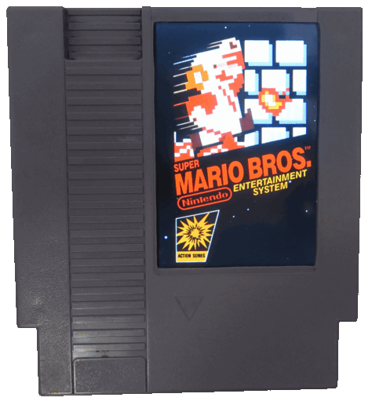

## PARA QUE TE SIRVE?

Esta pagina te servira para programar el esp32 sin nesecidad de un programa, solo necesitas tu computadora y un cable usb, aqui dejare links donde podras programar tu ESP32 con todos los proyectos que lanzando en mi canal de [YOUTUBE XGAMES VIDEOJUEGOS](https://www.youtube.com/channel/UCusIoB_4vKBwBtdc81PolUw)

Debo enfatisar que este proyecto de flashear el ESP32 de forma online no es mio, todos los creditos y gracias a [Witnessmenow](https://github.com/witnessmenow/ESP-Web-Tools-Tutorial). Tambien quiero agradecer a Erving Olvera que siempre esta ai para ayudarme cuando tengo alguna duda, SPYRO GAMES!!!

### CONTROLES BLUEGAMEPAD

En este proyecto aprenderemos a hacer nuestros controles compatibles con SWITCH, BLUERETRO, PC y ANDROID

[PROGRAMAR ESP32 PARA CREAR CONTROLES BLUEGAMEPAD](new_controls.md).

### CONTROLES SWITCH DIY

En este proyecto aprenderemos a hacer nuestros controles compatibles con nintendo switch.

[PROGRAMAR ESP32 PARA CREAR CONTROLES SWITCH DIY](controles_switch.md).

### CONTROLES BLUETOOTH

En este proyecto aprenderemos a convertir nuestros controles de nes, snes, sega, etc.. en controles bluetooth

[PROGRAMAR ESP32 PARA CREAR CONTROLES BLUETOOTH](controlesbluetooth.md).

### BLUERETRO PARA TUS CONSOLAS RETRO

[PROGRAMAR ESP32 PARA BLUERETRO](blueretro.md).

### COSAS PARA GAMERS

       

[PROGRAMAR ESP32](cartnes.md).

### MODS CONSOLAS
 

[PROGRAMAR ESP32](mods_consolas.md).

### GUNPAD32 LIGHTGUN BLUETOOTH
 

[PROGRAMAR ESP32](gunpad32.md).

