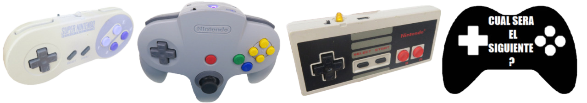
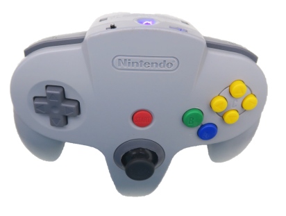

[PAGINA PRINCIPAL](index.md)

# CONTROLES BLUEGAMEPAD

En este proyecto aprenderemos a convertir nuestros controles en controles compatibbes con nuestro nintendo switch.
Este proyecto esta basado en el trabajo de [mitchellcairns](https://github.com/mitchellcairns)

Y quiero agradecer a Ervin Olvera por ayudarme a terminar este proyecto.

### Nuestro primer control sera el de N64

 <esp-web-install-button manifest="proyectos/controles_switch/nes/manifest.json">
  
  <input class="btn" type="button" slot="activate"/>
  Ah snap, your browser does not support WebSerial API! If you are using a mobile browser, this is expected. Please, move to the desktop version.
  Ah snap, you are not allowed to use this on HTTP!
</esp-web-install-button>

Usa este POWER SWITCH con responsabilidad.

